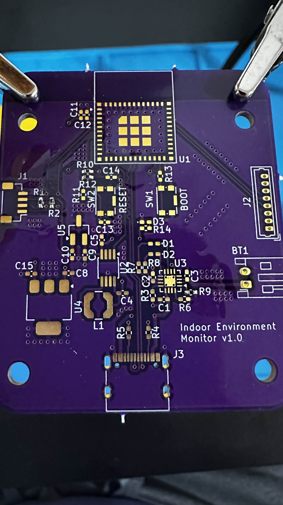
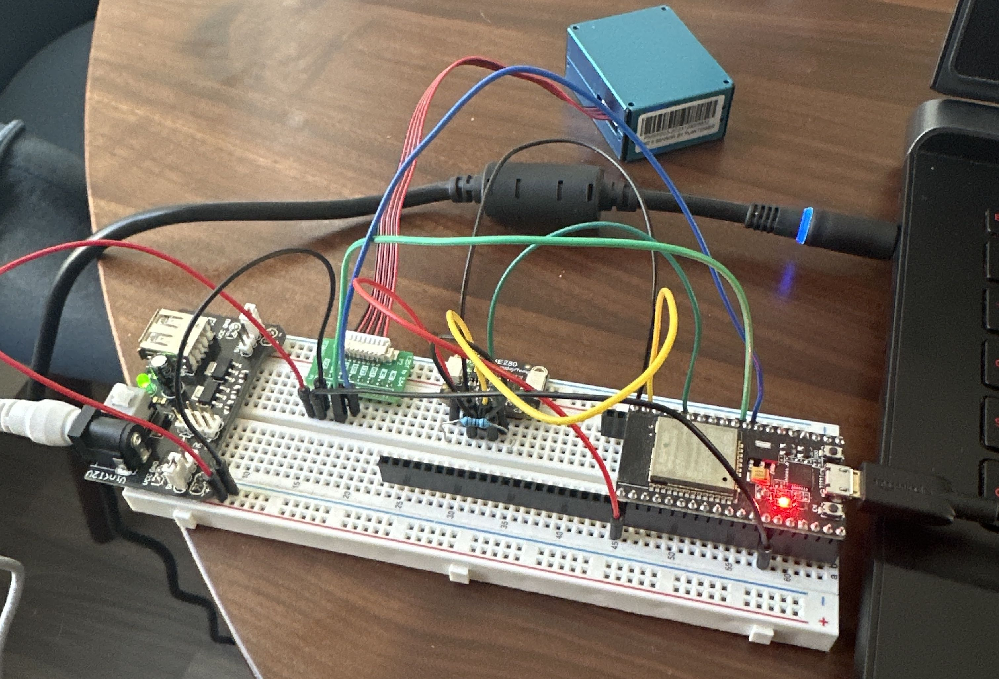
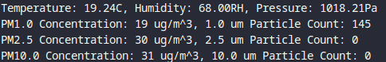

# Indoor Environment monitor

## Description
This is a project I created to monitor the conditions of my living space. The main inspiration behind this project was to monitor indoor air quality in order to know when
to turn on air purifiers. Since I live in an area that can have poor air quality during the summer months, it could be useful to have localized data for this purpose.

## Specifications
This project was created in VS Code with the ESP IDF v5.5 extension. The hardware used is listed in the table below.

| Component | Description |
| :-------: | :---------: |
| ESP32     | ESP32 C6-Mini-1 |
| BME280    | Adafruit BME280 STEMMA QT board |
| PMS5003   | Adafruit PM2.5 Air Quality Sensor and Breadboard Adapter Kit |

## State of the Project
Everything below this will act as a development blog.

## October 30, 2025

Soldering has begun.

Disclaimer: I am not an electrical engineer and have no formal training in hardware/pcb design. I understand now that some of my passive component choices might not be ideal. In any case, I don't think I will be using 0402 size components unless absolutely necessary. They are TINY! :D

## October 24, 2025
All components have arrived, except for that one silly cable for the BME280 board that I forgot to order from Adafruit.

## October 11, 2025
PCB design is done (for now) and I have ordered the PCBs from OSHPark.

## September 23, 2025
I want to move this project off the breadboard into a more compact design. I decided to start designing a PCB in KiCad.

## September 19, 2025

Breadboarding is complete. Data is being read from both sensors as seen below.

## September 15, 2025
The BME280 is currently communicating over I2C using a custom driver and the ESP IDF HAL.

The next step is to write a custom driver for the PMS5003 sensor utilizing UART.
